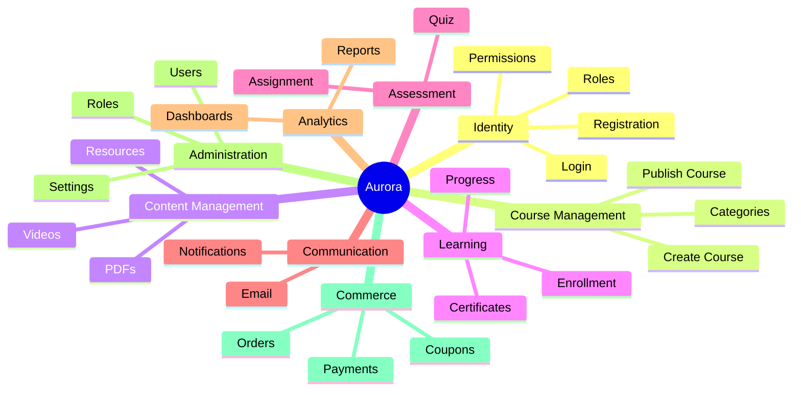
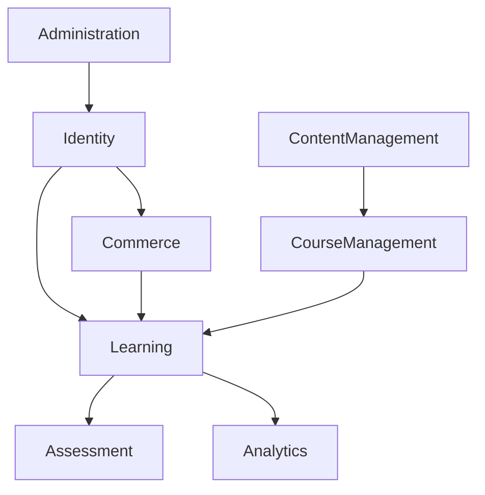

# 🧩 Aurora Platform Capability Model

> **Defines the core business capabilities of Project Aurora.**

---


---

# 📖 Purpose

The Business Capability Model defines **what Aurora is capable of doing** from a business perspective.

It focuses on **business capabilities**, not implementation details.

This document serves as the foundation for:

- Business Requirements Document (BRD)
- Software Requirements Specification (SRS)
- Database Design
- API Design
- System Architecture
- Sprint Planning

---

# 📄 Document Information

| Property | Value |
|-----------|-------|
| Document | Business Capability Model |
| Document ID | AUR-BCM-001 |
| Version | 0.1 |
| Status | Draft |
| Phase | Business Analysis |
| Repository | Project Aurora |
| Owner | Aurora Core Team |

---

# 🎯 Objectives

This document helps contributors understand:

- What Aurora can do
- The major business domains
- How features are organized
- How future modules will be designed

---

# 🏛 Capability Hierarchy

```text
Project Aurora

├── Identity
├── Course Management
├── Content Management
├── Learning
├── Assessment
├── Communication
├── Analytics
├── Administration
└── Commerce
```

---

# 🗺 Platform Capability Map



---

# 🔐 Capability 1 — Identity

## Purpose

Manage user identity and secure access to the platform.

### Features

| Feature | Description |
|----------|-------------|
| Registration | Create new account |
| Login | Authenticate user |
| Password Reset | Recover account |
| Profile | Manage personal information |
| Roles | Student, Instructor, Admin |
| Permissions | Access Control |

---

# 🎓 Capability 2 — Course Management

## Purpose

Manage the lifecycle of courses.

### Features

| Feature | Description |
|----------|-------------|
| Create Course | Build new course |
| Update Course | Modify course |
| Publish Course | Make course available |
| Archive Course | Retire course |
| Categories | Organize courses |

---

# 🎥 Capability 3 — Content Management

## Purpose

Manage learning resources.

### Features

| Feature | Description |
|----------|-------------|
| Videos | Upload lessons |
| PDFs | Learning material |
| Attachments | Supporting files |
| Resources | External references |

---

# 📚 Capability 4 — Learning

## Purpose

Deliver structured learning experiences.

### Features

| Feature | Description |
|----------|-------------|
| Enrollment | Join course |
| Progress | Track completion |
| Resume Learning | Continue where left off |
| Bookmarks | Save lessons |
| Certificates | Completion certificate |

---

# 📝 Capability 5 — Assessment

## Purpose

Evaluate learner performance.

### Features

| Feature | Description |
|----------|-------------|
| Quiz | Knowledge check |
| Assignment | Practical tasks |
| Results | Assessment outcomes |
| Evaluation | Performance review |

---

# 📢 Capability 6 — Communication

## Purpose

Facilitate communication between the platform and users.

### Features

| Feature | Description |
|----------|-------------|
| Notifications | Platform alerts |
| Email | Transactional emails |
| Announcements | Course updates |
| Discussions | Community interactions (Future) |

---

# 📊 Capability 7 — Analytics

## Purpose

Generate insights for stakeholders.

### Features

| Feature | Description |
|----------|-------------|
| Student Reports | Individual progress |
| Course Reports | Course performance |
| Dashboard | Platform insights |
| Metrics | Usage statistics |

---

# ⚙ Capability 8 — Administration

## Purpose

Govern and manage the platform.

### Features

| Feature | Description |
|----------|-------------|
| User Management | Manage users |
| Role Management | Manage permissions |
| Platform Settings | Configure platform |
| Audit Logs | Track activities |

---

# 💳 Capability 9 — Commerce

## Purpose

Manage commercial operations.

### Features

| Feature | Description |
|----------|-------------|
| Orders | Purchase records |
| Payments | Payment processing |
| Coupons | Discount management |
| Refunds | Payment reversal |
| Transactions | Financial history |

---

# 🔄 Capability Relationships



---

# 🚀 Future Capabilities

These are intentionally excluded from Version 1.

- AI Tutor
- Live Classes
- Mobile Applications
- Marketplace
- Community Forum
- White-label Platform
- Multi-tenancy

---

# 📌 Key Design Principles

- Capability-first architecture
- Modular development
- Separation of concerns
- Scalable design
- Open-source collaboration
- Security by design

---

